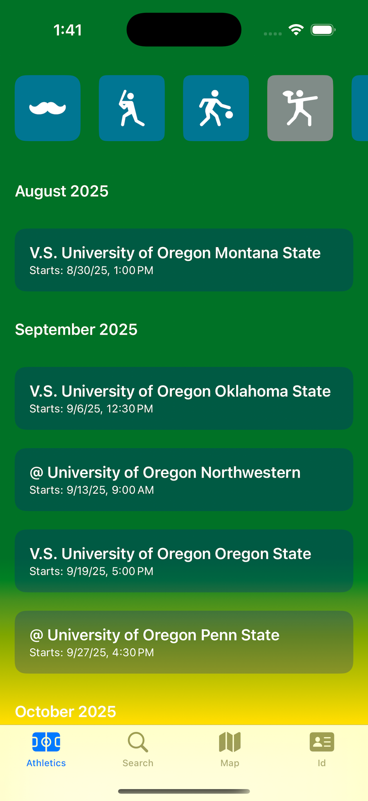

# SwooshU App

### Welcome to the SwooshU Git Page!

This app, *designed by Oscar Epp*, is a educational app for students in the Eugene Oregon area attending the University of Oregon.

#### There are three main features of the App:

## Oregon Athletics

The Oregon Athletics page features a schedule overview of each Mens & Womens Sports

The infomation comes from a GoDucks iCal subscription. The App using, custom code written by me, fetches the data
and features it on the app. The data is updated and accurate without maintenance

  
## Campus Map

The Campus Map gives an overview of the UofO campus. It allows users to easily find the building they're 
looking for, along with an indoor map to find the right classroom as well as a short exerpt on campus history.

## DuckID

The DuckID section allows students to upload an image of their duckID to easly access campus building using a
barcode. Often times you might forget your ID when going to the student recenter for example, this ensures
you have easy access on your phone.

##

  
  
  
  

